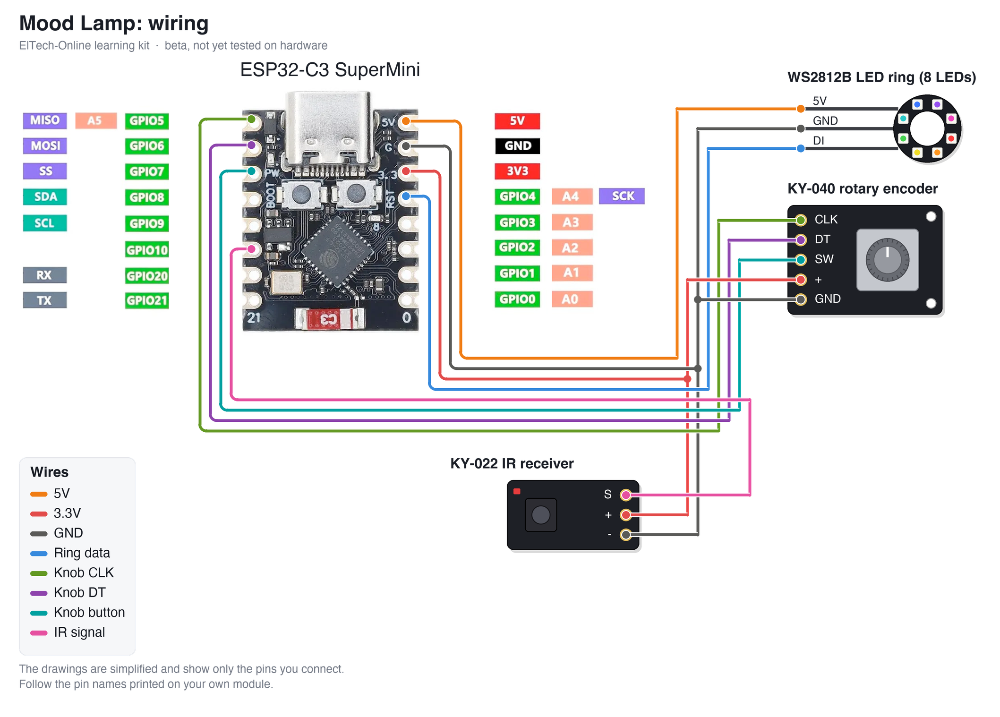

# ElTech-Online ESP32-C3 Mood Lamp

[](https://buymeacoffee.com/eltech)

> **Status: BETA, not tested.** The code compiles for the ESP32-C3, but this kit has not been built and tested on real hardware yet. Pin choices, default values and the wiring may still change. Use it to read and learn from; expect to do some fault-finding if you build it now.

A beginner-friendly **learning kit**: build a colour-changing lamp from an **ESP32-C3 SuperMini**, an **8-LED WS2812B ring**, a **KY-040 rotary encoder** (a knob) and a **KY-022 infrared receiver**. Control it three ways: turn the knob, point any TV remote at it, or open the web page the board hosts on your phone. No prior electronics or coding experience needed, and no soldering: everything plugs into a breadboard.

Designed, coded and documented by ElTech-Online in Callander, Scotland — the kit design, firmware and this guide are our own work.


## What you'll learn

One small project, four techniques:

- **Addressable LEDs** — one data wire sets the colour of every LED on the ring separately
- **Reading a rotary encoder** — counting clicks and telling the direction, using an interrupt
- **Decoding an infrared remote** — measuring pulse timings and turning them into a button code
- **Controlling hardware from a web page** — a colour picker on your phone changes a real light

Along the way you'll also pick up:

- **One source of truth** — knob, remote and web page all change the same few values, so they never disagree
- **Saving settings in flash memory** — the lamp comes back the way you left it
- **Doing several things at once** without `delay()`

The code is written to be read: every section is commented in plain language, and [How the code works](#how-the-code-works) walks through it.

## How the parts work

**The LED ring.** Each WS2812B LED has a tiny chip inside. The board sends a stream of colour values down one data wire; the first LED keeps the first value and passes the rest on, the second LED does the same, and so on round the ring. That is why three wires are enough for any number of LEDs.

**The knob.** A rotary encoder has no end stops and no "position". Inside are two switches, CLK and DT, that open and close one after the other as it turns. Which one changes first tells you the direction. A click is over in a few milliseconds, so the sketch uses an *interrupt*: the board drops what it is doing the instant CLK changes.

**The remote.** A remote flashes an invisible infrared LED. The receiver turns the flashes into a wire that goes LOW while the remote is flashing. Most remotes use the **NEC** code, where everything is in the timing between one fall of the wire and the next: 13.5 ms starts a button press, 1.125 ms is a 0 bit, 2.25 ms is a 1 bit. 32 bits make the button's code. The sketch decodes this itself, in about 30 lines, with no library.

## What it does

- Four effects: **Solid**, **Rainbow**, **Breathe** and **Candle**
- Knob: turn = brightness, press = next effect, hold 1 second = on/off, hold down and turn = colour
- Remote: teach it any five buttons of your own remote (power, next effect, brighter, dimmer, next colour)
- Web page: on/off, colour picker, brightness slider, effect buttons, and the remote-learning screen. The page follows the knob and remote live
- Remembers colour, brightness, effect and the learned buttons when the power is off

It also runs a self-test at power-on and prints it to Serial (115200 baud):

```
--- Self-test ---
LED ring:      shown red, green, blue (check by eye)
Rotary knob:   OK
IR receiver:   press a remote button, a code should print here
WiFi AP:       OK
RESULT:        PASS
```

The ring and the IR receiver can't tell the board they are there, so those two are checks you make yourself.

There are **two sketches** in this repo:

| Sketch | What it is |
|---|---|
| `ring_test/` | The smallest possible start: one LED chases round the ring, changing colour. About 15 lines of code. Begin here. |
| `mood_lamp/` | The full project: ring + knob + remote + web page. |

## Hardware

| Component | Notes |
|---|---|
| ESP32-C3 SuperMini |  |
| WS2812B LED ring, 8 LEDs | Pads marked `5V` (or `VCC`), `GND` and `DI`. Use `DI` (data in), not `DO`. |
| KY-040 rotary encoder module | 5 pins: `CLK`, `DT`, `SW`, `+`, `GND` |
| KY-022 infrared receiver module | 3 pins: `S`, `+` (middle) and `-` |
| Breadboard + jumper wires | 11 wires |
| Any infrared remote | Not in the kit: use a TV, media-player or LED-strip remote you already have |

## Wiring

| Wire | ESP32-C3 pin | Connects to |
|---|---|---|
| 5V | 5V | WS2812B LED ring `5V` |
| 3.3V | 3V3 | KY-040 rotary encoder `+`, KY-022 IR receiver `+` |
| GND | GND | WS2812B LED ring `GND`, KY-040 rotary encoder `GND`, KY-022 IR receiver `-` |
| Ring data | GPIO 4 | WS2812B LED ring `DI` |
| Knob CLK | GPIO 5 | KY-040 rotary encoder `CLK` |
| Knob DT | GPIO 6 | KY-040 rotary encoder `DT` |
| Knob button | GPIO 7 | KY-040 rotary encoder `SW` |
| IR signal | GPIO 10 | KY-022 IR receiver `S` |



The parts are drawn in a simplified way, showing only the pins you connect. **Always follow the labels printed on your own modules** — the pin order differs between manufacturers.

Good to know:

- **The ring is powered from 5V**, straight from USB. The sketch limits its brightness (`MAX_BRIGHTNESS`) so the 8 LEDs can't draw more than a USB port likes to give.
- **The knob and IR receiver are powered from 3V3**, so their signals are safe for the ESP32's pins.
- **GPIO 4, 5, 6, 7 and 10** are plain pins. GPIO 2, 8 and 9 are avoided: the board also uses them to decide how to start up.

## Setup (Arduino IDE)

**Before you start:** download and install the free **Arduino IDE 2** from [arduino.cc/en/software](https://www.arduino.cc/en/software). The ESP32-C3 connects over its own USB-C port, so there's no separate USB driver to install. Use a USB cable that carries data: some cheap cables only charge, and then the board never shows up.

1. **Add the ESP32 board index**: `File > Preferences` → Additional Boards Manager URLs:
   ```
   https://raw.githubusercontent.com/espressif/arduino-esp32/gh-pages/package_esp32_index.json
   ```
2. **Install the board package**: `Tools > Board > Boards Manager`, search "esp32", install **esp32 by Espressif Systems**.
3. **Select the board**: `Tools > Board > esp32 > ESP32C3 Dev Module`.
4. **Tools menu settings**:

   | Setting | Value |
   |---|---|
   | Board | ESP32C3 Dev Module |
   | USB CDC On Boot | Enabled |
   | CPU Frequency | 160MHz |
   | Erase All Flash Before Sketch Upload | Disabled |
   | Flash Size | 4MB (32Mb) |
   | Partition Scheme | Default 4MB with spiffs (1.2MB APP/1.5MB SPIFFS) |
   | Upload Speed | 921600 |

5. **Install libraries** via `Sketch > Include Library > Manage Libraries`:
   - Adafruit NeoPixel

   If Library Manager asks to install dependencies (Adafruit BusIO, Adafruit Unified Sensor), click **Install all**.

   **Compiled with** these versions (compile-tested only; hardware confirmation pending):

   | Package | Version |
   |---|---|
   | esp32 by Espressif Systems (board package) | 3.3.11 |
   | Adafruit NeoPixel | 1.15.5 |

6. Open `ring_test/ring_test.ino` first, upload it, and check the ring lights. Then open `mood_lamp/mood_lamp.ino` and upload that.

### Opening the Serial Monitor

1. Open it with `Tools > Serial Monitor`.
2. Set the speed drop-down to **115200 baud**. At the wrong speed, you'll see garbled characters or nothing at all.
3. The self-test only runs once, right after the board starts. If you opened the Serial Monitor too late, press the board's **RST** (reset) button to run it again.

**Seeing nothing at all?** Check that `Tools > USB CDC On Boot` is set to **Enabled**.

### If the upload fails

If the upload stops with an error like `Failed to connect`, put the board into download mode by hand:

1. Hold down the **BOOT** button on the board.
2. While holding it, press and release **RST** (or unplug and re-plug the USB cable).
3. Release **BOOT**, choose the port under `Tools > Port` and click **Upload** again.
4. When the upload finishes, press **RST** once to start the new code.

## The web page

1. Upload the main sketch. Every board creates its **own** network name (e.g. `ElTech-ML-A3F2`) and its **own** random 8-character password, saved in the board's flash memory.
2. Serial Monitor shows the network name, the password and the address `http://192.168.4.1`.
3. On your phone or laptop, connect to that WiFi network, then open that address in a browser. Your phone may warn that the network has no internet: that is expected, stay connected.

This is a standalone Access Point, not connected to your home WiFi or the internet. Range is roughly a typical room. The WiFi code and the page's style sheet live in `eltech_wifi.h`, a second tab in the sketch, so the main file can stay about this kit's own lesson.

## Teaching it your remote

1. Open the web page and find **Teach it your remote**.
2. Press **Learn** next to an action, for example *Brighter*.
3. Point your remote at the receiver and press the button you want to use.

The page shows the code it received. Learned buttons are saved in flash memory. If nothing happens when you press a button, that remote probably doesn't use the NEC code: try a different one.

## How the code works

Open `mood_lamp/mood_lamp.ino` alongside this section. The file starts with a short guide to its own layout. Every Arduino sketch has two main functions: `setup()` runs once when the board starts, and `loop()` then runs over and over, forever.

1. **Settings at the top.** Pin numbers and `MAX_BRIGHTNESS` are named values you can change in one place.
2. **Lamp state.** Five variables (`lampOn`, `hue`, `saturation`, `brightPct`, `effect`) describe everything the lamp shows.
3. **Drawing the ring.** `drawRing()` runs 50 times a second and works out each LED's colour for that moment. Nothing changes on the LEDs until `ring.show()`.
4. **The knob.** `knobTurned()` is the interrupt: it only counts. `handleKnob()` in `loop()` uses the count and tells a short press from a long one.
5. **The remote.** `irFell()` is the interrupt that measures the gaps and builds the 32-bit code. `handleRemote()` compares it with the learned buttons.
6. **The web server.** `/state` sends the lamp's state as JSON, `/set` changes it, `/learn` starts remote learning. The page (`page_template.h`) asks for `/state` once a second.
7. **Saving.** Settings are written to flash 3 seconds after the last change, not on every click, because flash wears a little with each write.

## Try this next

Small changes to try yourself, roughly easiest first. Change one thing, upload, and check the result before moving on.

1. **Change the brightness limit.** Edit `MAX_BRIGHTNESS` (keep it at 150 or below on USB power).
2. **Change the rainbow's speed.** In `drawRing()`, change the `10` in `now * 10`.
3. **Add a fifth effect.** Add a name to `EFFECT_NAMES`, raise `EFFECT_COUNT`, and add an `else if (effect == 4)` block. Try a single LED chasing round, as in `ring_test`.
4. **Add a sleep timer.** Note `millis()` when the lamp is switched on and switch it off 30 minutes later.
5. **Add a sixth remote action**, for example *white light*: add it to `ACTION_NAMES`, raise `ACTION_COUNT`, and handle it in `doAction()`.

## Beta notes

This repository is published early. Still to be confirmed on real hardware:

- Ring data at 3.3 V logic with the ring on 5 V (usually fine; if the colours glitch, power the ring from 3V3 instead)
- LED ring, IR interrupts and WiFi running together on the ESP32-C3
- The power-on check for the knob assumes the module has pull-up resistors on CLK and DT

Found a problem? Please open an issue on this repository.

## License

The code, documentation and wiring diagram are MIT-licensed — see [LICENSE](LICENSE). Use them, modify them, build your own kit with them.

**The ElTech-Online name and logo are not covered by the MIT license.** The logo files (`logo.png` and any `logo_bitmap.h`) are © ElTech-Online, all rights reserved. If you build or sell your own version, swap in your own logo and don't present it as an ElTech-Online product.
